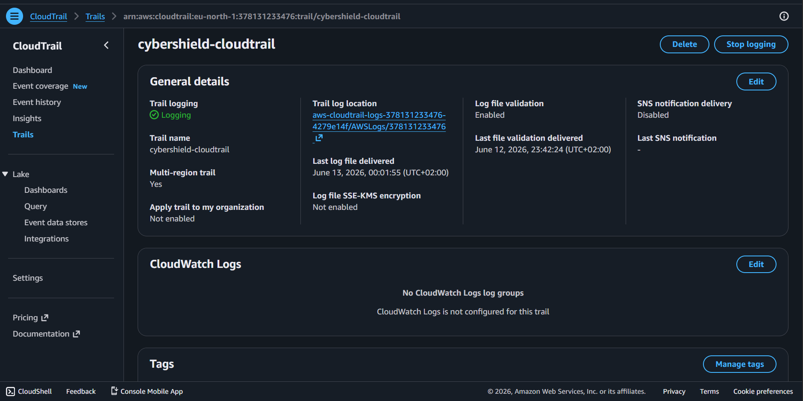
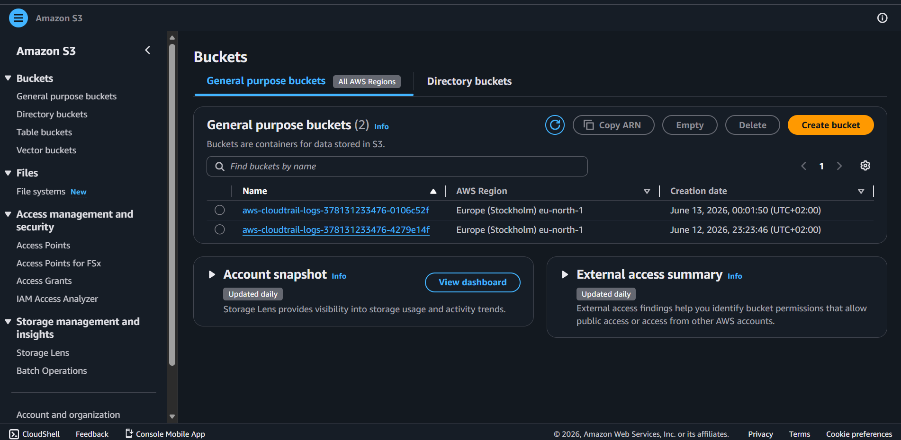
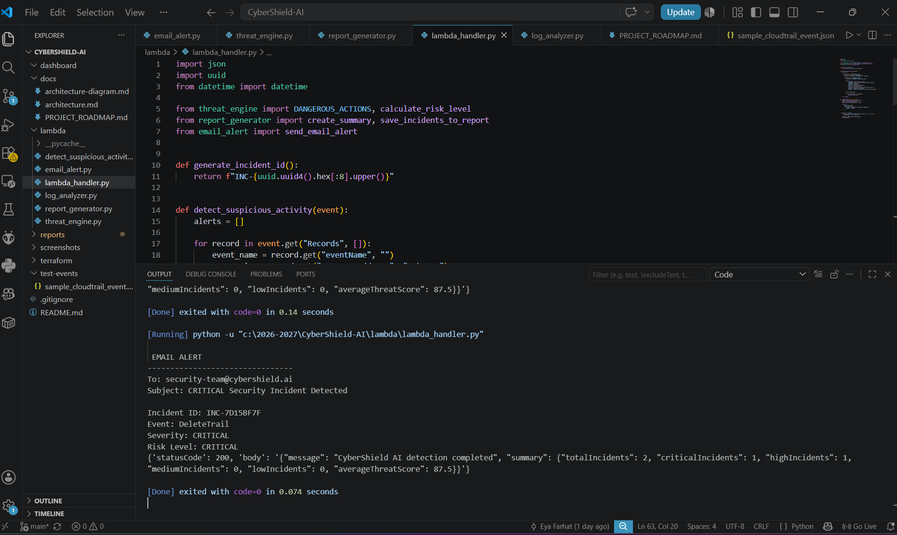
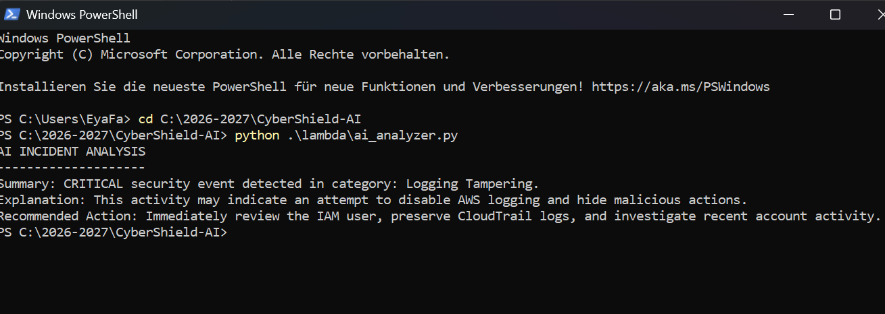
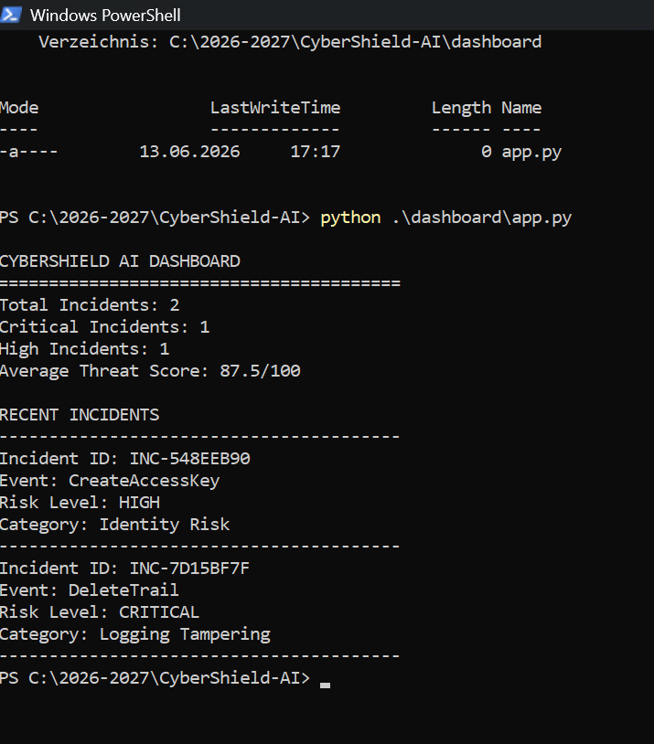
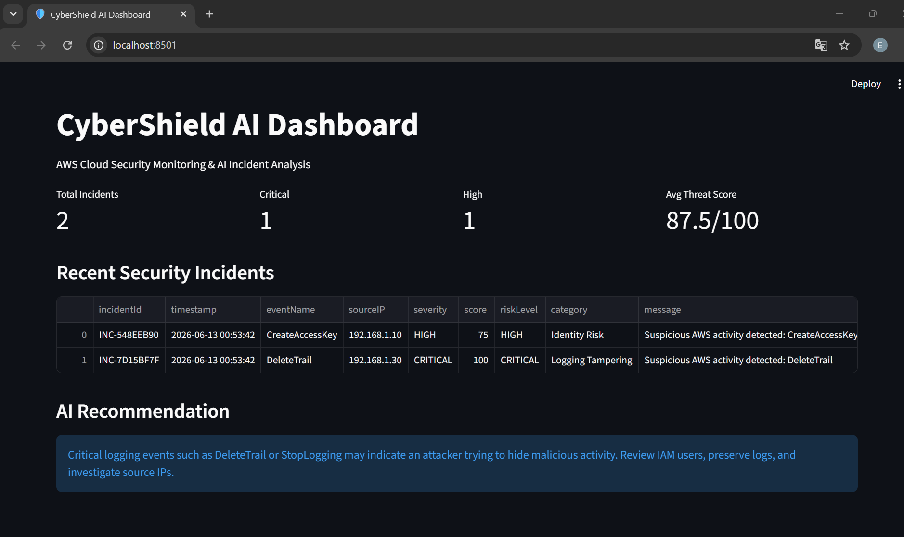

# CyberShield AI


AI-Powered AWS Cloud Security Detection and Automated Incident Response Platform.

## Status

CyberShield AI v1.0 is portfolio-ready.

## Project Goal

CyberShield AI monitors AWS security activity, detects suspicious behavior, sends alerts, and later can automatically respond to threats.

## First Version Architecture


```text
AWS CloudTrail
      ↓
Amazon S3
      ↓
AWS Lambda
      ↓
Amazon SNS Email Alert
```

## Technologies

- AWS CloudTrail
- Amazon S3
- AWS Lambda
- Amazon SNS
- Python
- Docker
- Terraform
- Next.js

## Features

- Collect AWS security logs
- Detect suspicious activity
- Send email alerts
- Store incidents
- Future dashboard for monitoring threats

## AWS Security Evidence

### CloudTrail Enabled

CloudTrail was configured to record management events across all AWS regions.



### S3 Log Storage

CloudTrail logs are stored securely in Amazon S3 buckets for auditing and security investigations.



### Email Alert Simulation

CyberShield AI generates security alerts when critical AWS actions are detected.



## Community

CyberShield AI is actively maintained and improved.

## AI Incident Analysis

CyberShield AI analyzes detected incidents and generates:

- Threat explanations
- Risk context
- Recommended security actions

Example:

DeleteTrail
↓
AI Analysis
↓
"This activity may indicate an attempt to disable AWS logging and hide malicious actions."
↓
Recommended Response



## Dashboard Prototype

CyberShield AI includes a dashboard prototype that displays:

- Total incidents
- Critical incidents
- High-risk events
- Threat scores
- Incident summaries

### Dashboard Output



## Web Dashboard

CyberShield AI includes a Streamlit-powered security dashboard.

Features:

- Incident monitoring
- Threat score visualization
- AI recommendations
- Security event reporting

### Dashboard



